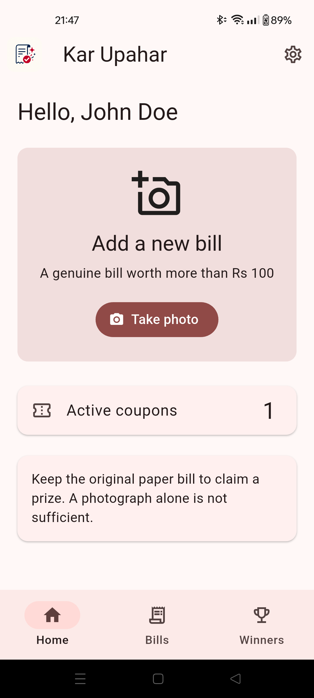
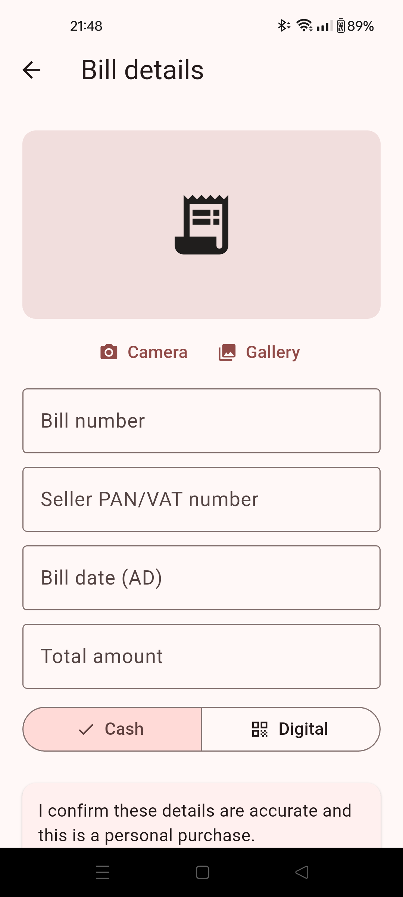
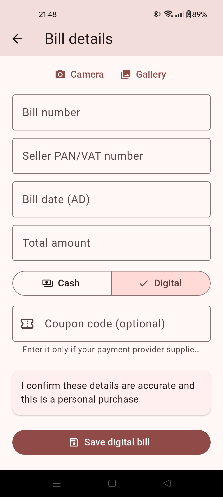
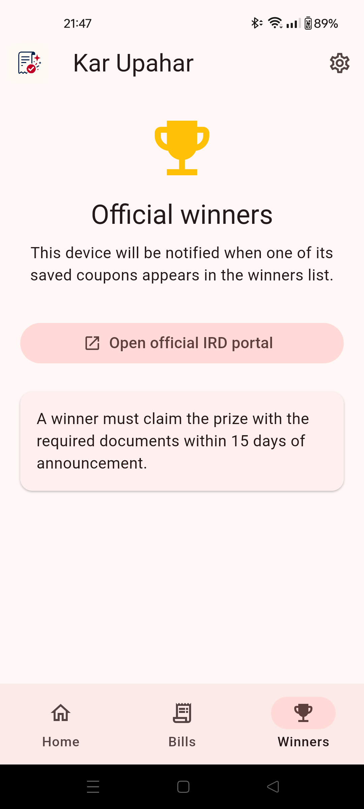

# Kar Upahar

Kar Upahar is an independent, bilingual Flutter companion for Nepal's Taxpayer
Incentive Gift Programme. Users can photograph and organize eligible purchase
bills, read common bill fields with on-device OCR, complete cash-bill enrollment
through the official IRD website, and save coupons for later winner checks.

This is **not an official Government of Nepal application**. The official portal
is the source of truth: <https://prize.ird.gov.np/>.

## Current features

- Android application with an iOS project prepared for future builds.
- English and Nepali UI.
- Camera and gallery bill capture.
- On-device Latin and Devanagari OCR for seller PAN/VAT, bill date, and total.
- BS and AD bill-date recognition; recognized BS dates are converted to AD.
- Local SQLite storage for profiles, bill details, photos, statuses, and coupons.
- Cash enrollment through an isolated IRD WebView.
- Digital-payment records with an optional coupon code.
- Optional Firebase notifications and winner synchronization.

OCR suggestions are always editable. If a value cannot be read confidently, the
field remains blank for manual entry.

## Screenshots

<table>
  <tr>
    <th>Home</th>
    <th>Bill entry and OCR</th>
  </tr>
  <tr>
    <td></td>
    <td></td>
  </tr>
  <tr>
    <th>Digital bill</th>
    <th>Winners</th>
  </tr>
  <tr>
    <td></td>
    <td></td>
  </tr>
</table>

## Repository layout

- `lib/` - Flutter UI, local storage, OCR, IRD integration, and Firebase client.
- `android/` - Android runner and bundled Latin/Devanagari ML Kit setup.
- `ios/` - iOS runner, CocoaPods configuration, and Devanagari ML Kit setup.
- `assets/` - Application logo and packaged assets.
- `test/` - Flutter validation and OCR parser tests.
- `functions/` - Firebase callable APIs and scheduled IRD winner checker.
- `functions/test/` - Winner-response adapter tests.
- `firestore.rules` - Denies direct mobile access; writes use callable functions.

## Developer prerequisites

For Android development:

- Flutter stable with Dart 3.12 or newer. The project is currently tested with
  Flutter 3.47.0 and Dart 3.13.0.
- Android Studio and an Android SDK accepted by `flutter doctor`.
- JDK 17.
- An emulator or Android phone with USB debugging enabled.

For iOS development:

- A Mac with a compatible Xcode version.
- CocoaPods.
- An iPhone or simulator running iOS 15.5 or newer.

Firebase backend development additionally requires Node.js 22 and the Firebase
CLI. Firebase is optional for local UI, OCR, storage, and IRD WebView development.

Do not run `flutter create` over this checkout. The platform folders already
contain application-specific permissions, icons, and native OCR dependencies.

## Run the app locally

From the repository root:

```powershell
flutter doctor
flutter pub get
flutter devices
flutter run -d <device-id>
```

On an attached Android phone, `<device-id>` is the identifier shown by
`flutter devices`. Keep the phone unlocked and approve the USB debugging prompt.
The first Android build may take longer while Gradle downloads the native OCR
models.

The application starts without Firebase configuration. In this mode, local bill
capture, OCR, saved entries, and the IRD flow remain available; push
notifications and cloud winner synchronization are disabled.

Useful Android commands:

```powershell
flutter build apk --debug
flutter install -d <device-id>
```

The debug APK is generated at
`build/app/outputs/flutter-apk/app-debug.apk`.

For iOS, run on macOS:

```bash
flutter pub get
cd ios
pod install
cd ..
flutter run -d <device-id>
```

Always open `ios/Runner.xcworkspace`, not `Runner.xcodeproj`, when working in
Xcode after installing pods.

## Tests and code checks

Run the Flutter checks from the repository root:

```powershell
flutter test
flutter analyze
```

Run the Firebase Functions tests separately:

```powershell
cd functions
npm ci
npm test
cd ..
```

Tests use local fixtures and do not submit bills to IRD. Never use fabricated
bills against the production enrollment page.

## Optional Firebase setup

The mobile application treats Firebase initialization as best-effort and
continues in local-only mode when configuration is missing.

Before configuring Firebase for a real environment:

1. Replace the placeholder Android application ID
   `com.example.kar_upahar` with the final package ID.
2. Create matching Android and iOS applications in a Firebase project.
3. Enable Anonymous Authentication, Cloud Firestore, Cloud Functions, Cloud
   Messaging, App Check, Remote Config, and Crashlytics.
4. Add the native Firebase configuration files:
   - `android/app/google-services.json`
   - `ios/Runner/GoogleService-Info.plist`, added to the Runner target in Xcode
5. Ensure the Android Google Services Gradle plugin is configured for the
   selected Firebase project.
6. Register App Check debug tokens before enabling enforcement in development.

These local configuration files are ignored by Git. Do not commit signing keys,
service-account credentials, or environment secrets.

The application defines these Remote Config defaults:

| Key | Default | Purpose |
| --- | --- | --- |
| `ird_submission_enabled` | `true` | Emergency submission kill switch |
| `ird_external_browser_fallback` | `false` | Open IRD in the external browser |
| `ird_portal_url` | `https://prize.ird.gov.np/` | Official enrollment page |

To build and test the backend:

```powershell
cd functions
npm ci
npm test
cd ..
firebase emulators:start
```

The Flutter client does not currently redirect Firebase SDK calls to local
emulators. The emulator command validates and runs the backend services; mobile
emulator integration requires explicit `use*Emulator` configuration in the app.

Deploy only after selecting the intended Firebase project:

```powershell
firebase use <project-id>
firebase deploy --only functions,firestore
```

## Privacy and operational behavior

- Profile fields, bill details, photographs, and raw OCR text are not uploaded.
- Raw OCR text is discarded after on-device parsing and is not logged.
- Firebase receives an anonymous installation, FCM token, app/platform metadata,
  coupon hash, and draw period when Firebase is enabled.
- Turnstile values remain inside the official IRD page and are not returned to
  Flutter or Firebase.
- Uninstalling the app removes local records; there is no account recovery or
  cloud photo backup.
- The scheduled winner checker reads the public IRD winner feed every 30 minutes
  and sends idempotent notifications to matching installations.

## Known integration boundary

IRD does not publish a supported mobile integration contract. The WebView logic
is deliberately isolated and controlled through Remote Config. If the official
form DOM or response changes, disable in-app submission and enable the external
browser fallback until the selectors and response parsing are updated.
